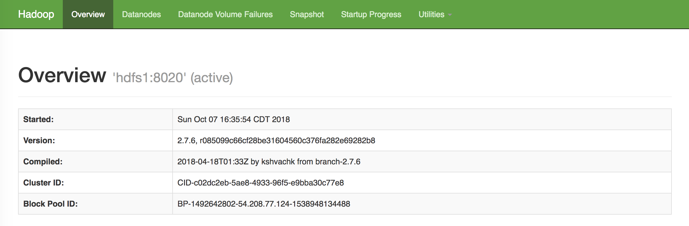
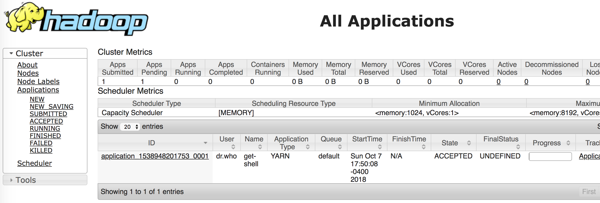

|Title |  HDFS Installation |
|-----------|----------------------------------|
|Author | Kenneth Chen |
|Utility | IBM, Softlayer, HDFS |
|Date | 9/10/2018 |

# HDFS Setup

Setup 3 virtual servers in the cloud.  
- 2 CPU 
- 4 GB RAM 
- 2 local disks: 25GB and 100 GB (100GB for HDFS setup later)

```
$ slcli vs create --datacenter=sjc01 --hostname=master --domain=mids.com --billing=hourly --cpu=2 --memory=4096 --disk=25 --disk=100 --network=1000 --os=CENTOS_LATEST_64
$ slcli vs create --datacenter=sjc01 --hostname=slave1 --domain=mids.com --billing=hourly --cpu=2 --memory=4096 --disk=25 --disk=100 --network=1000 --os=CENTOS_LATEST_64
$ slcli vs create --datacenter=sjc01 --hostname=slave2 --domain=mids.com --billing=hourly --cpu=2 --memory=4096 --disk=25 --disk=100 --network=1000 --os=CENTOS_LATEST_64
```

```
$ slcli vs list
:..........:..........:...............:..............:............:........:
:    id    : hostname :   primary_ip  :  backend_ip  : datacenter : action :
:..........:..........:...............:..............:............:........:
: 63010091 :  master  :  198.23.82.41 : 10.91.105.22 :   sjc01    :   -    :
: 63010111 :  slave1  :  198.23.82.40 : 10.91.105.18 :   sjc01    :   -    :
: 63010119 :  slave2  :  198.23.82.38 : 10.91.105.41 :   sjc01    :   -    :
:..........:..........:...............:..............:............:........:
```
Open 3 separate terminals to ssh into 3 vs. Make sure you got the passwords for each vs by calling 
```
$ slcli vs credentials 63010091

:..........:..........:
: username : password :
:..........:..........:
:   root   :          :
:..........:..........:

$ ssh root@198.23.88.164
```

#### Change the DNS in each node

```
# vi /etc/hosts

127.0.0.1      localhost.localdomain localhost
198.23.82.41   master.hadoop.mids.lulz.bz master
198.23.82.40   slave1.hadoop.mids.lulz.bz slave1
198.23.82.38   slave2.hadoop.mids.lulz.bz slave2
```

Check disks and which is a mounted disk
```
# fdisk -l | grep Disk | grep GB
Disk /dev/xvdc: 107.4 GB, 107374182400 bytes, 209715200 sectors
Disk /dev/xvda: 26.8 GB, 26843545600 bytes, 52428800 sectors

# mount | grep ' \/ '
/dev/xvda2 on / type ext3 (rw,noatime,seclabel,data=ordered)
```

Making the file allocation (inode)
```
# mkdir /data
# mkfs.ext4 /dev/xvdc

mke2fs 1.42.9 (28-Dec-2013)
Filesystem label=
OS type: Linux
Block size=4096 (log=2)
Fragment size=4096 (log=2)
Stride=0 blocks, Stripe width=0 blocks
6553600 inodes, 26214400 blocks
1310720 blocks (5.00%) reserved for the super user
First data block=0
Maximum filesystem blocks=2174746624
800 block groups
32768 blocks per group, 32768 fragments per group
8192 inodes per group
Superblock backups stored on blocks: 
	32768, 98304, 163840, 229376, 294912, 819200, 884736, 1605632, 2654208, 
	4096000, 7962624, 11239424, 20480000, 23887872

Allocating group tables: done                            
Writing inode tables: done                            
Creating journal (32768 blocks): done
Writing superblocks and filesystem accounting information: done   
```

#### Defining the disk path

```
# vi /etc/fstab

/dev/xvdc /data             ext4  defaults,noatime        0  0
```

It will look like this
```
UUID=afb76a75-314e-4fb8-9cca-79c61c4a10d8 /                       ext3    defaults,noatime,noatime        1 1
UUID=deb85407-6f2a-475d-9018-9dfeeeb8f3fd /boot                   ext3    defaults,noatime,noatime        1 2
LABEL=SWAP-xvdb1 swap swap    defaults        0 0

/dev/xvdc /data             ext4  defaults,noatime        0  0
```
#### Mount the disk 
```
# mount /data
# chmod 1777 /data
```

# System Setup
Install 
```
# yum install -y rsync net-tools java-1.8.0-openjdk-devel ftp://fr2.rpmfind.net/linux/Mandriva/devel/cooker/x86_64/media/contrib/release/nmon-14g-1-mdv2012.0.x86_64.rpm
```
Setting the user and password. `passwd` will ask you to set the password for the user `hadoop`.
```
# adduser hadoop
# passwd hadoop
```

Install HDFS and extract in `/usr/local`
```
# cd /usr/local
# curl http://apache.claz.org/hadoop/core/hadoop-2.7.6/hadoop-2.7.6.tar.gz | tar -zx -C /usr/local --show-transformed --transform='s,/*[^/]*,hadoop,'
```

To allow permission on each directory. So far we have worked on `/data` and `/usr/local` directory. 
```
# chown -R hadoop.hadoop /data
# chown -R hadoop.hadoop /usr/local/hadoop
```

### Setting the passwordless between 3 nodes

-------------------------
##### Suggested setup 
You must log in as `hadoop` user you created earlier. 
The following keygen setup is what I did. Before we setup keygen, we will login as `hadoop` user as we created earlier. This will change the prompt.
```
# su - hadoop
[hadoop@master ~]$ 
```

`ssh-keygen` in hdfs1 will generate `id_rsa` (private) and `id_rsa.pub` (public) keys. You need to copy to other 2 nodes. When asked for password in each node, use the password you set earlier in adduser creation.
```
# ssh-keygen
# for i in master slave1 slave2; do ssh-copy-id $i; done
```
It will keep asking you password when log into other slave nodes. Type the password you set earlier when created `hadoop` user. If the passwordless functions as expected, you should be able to ssh between each node without password. Test in each node. `Ctrl+d` to log out from the node. 

--------------------------

#### Checking nodes communication 

Now we're going to check all nodes communication without password. So the idea is create the ssh-keygen in one node, which will generate private and public key. Make sure you'd use id_rsa. Not other customized names which doesn't work as expected. 

```
# ssh-keygen -f ~/.ssh/id_rsa -b 2048 -t rsa 
# cat ~/.ssh/id_rsa.pub >> ~/.ssh/authorized_keys 
# chmod 600 ~/.ssh/authorized_keys
```

You now copy all files in the `.ssh` directory:  
- authorized_keys  
- id_rsa  
- id_rsa.pub  
to all nodes in the cluster. We have 3 nodes set up in our cluster. So we need to copy all files into the other 2 nodes. 

```
# scp ~/.ssh/* root@198.23.82.40:/root/.ssh/
# scp ~/.ssh/* root@198.23.82.38:/root/.ssh/
```
You open 3 individual terminals. In each terminal, ssh into individual nodes and check if those scp works from master node. After all done, try this from each node (each terminal). You'll be sshing from master to slave1. It doesn't matter. We want to add the information into known_hosts. You'll do those in other two terminals as well. 
```
# ssh master
yes
exit
# ssh slave1
yes
exit
# ssh slave2
yes 
exit
```
After you're done, make sure they work. Now in master node (terminal), 
```
# vi test.sh
```
Copy the following script
```
ch
```
Change to executable mode 
```
# chmod 755 test.sh
```
run the script. If all nodes communicate without password (In order for GPFS to work, each node must communicate passwordless), you'd see your script works. If nodes communication fails, you'd see some errors here. 
```
# ./test.sh
root@gpfs1:~# ./test.sh
Testing master to master: Sun Oct  7 20:12:43 CDT 2018
Testing master to slave1: Sun Oct  7 20:12:44 CDT 2018
Testing master to slave2: Sun Oct  7 20:12:45 CDT 2018
Testing slave1 to master: Sun Oct  7 20:12:45 CDT 2018
Testing slave1 to slave1: Sun Oct  7 20:12:46 CDT 2018
Testing slave1 to slave2: Sun Oct  7 20:12:47 CDT 2018
Testing slave2 to master: Sun Oct  7 20:12:47 CDT 2018
Testing slave2 to slave1: Sun Oct  7 20:12:48 CDT 2018
Testing slave2 to slave2: Sun Oct  7 20:12:49 CDT 2018
```

### Export Path
You now need to define the hadoop path in `~/.bash_profile`. For java path, since we want to export the working path from the system, it's different from other paths export method. You could either do `|grep` line or just copy and paste the path I already retrieved. You can just `cat` all other paths or copy and paste in `~/.bash_profile` from the 2nd export method. 

##### 1. Export Method
```
# echo "export JAVA_HOME=\"$(readlink -f $(which javac) | grep -oP '.*(?=/bin)')\"" >> ~/.bash_profile
# cat <<\EOF >> ~/.bash_profile
export HADOOP_HOME=/usr/local/hadoop
export HADOOP_MAPRED_HOME=$HADOOP_HOME
export HADOOP_HDFS_HOME=$HADOOP_HOME
export YARN_HOME=$HADOOP_HOME
export PATH=$PATH:$HADOOP_HOME/bin:$HADOOP_HOME/sbin
EOF
```

##### 2. Export Method
```
# vi ~/.bash_profile

export JAVA_HOME="/usr/lib/jvm/java-1.8.0-openjdk-1.8.0.181-3.b13.el7_5.x86_64"
export HADOOP_HOME=/usr/local/hadoop
export HADOOP_MAPRED_HOME=$HADOOP_HOME
export HADOOP_HDFS_HOME=$HADOOP_HOME
export YARN_HOME=$HADOOP_HOME
export PATH=$PATH:$HADOOP_HOME/bin:$HADOOP_HOME/sbin
```

Activate the bash_profile
```
# source ~/.bash_profile
```
Check the java version
```
# $JAVA_HOME/bin/java -version

openjdk version "1.8.0_181"
OpenJDK Runtime Environment (build 1.8.0_181-b13)
OpenJDK 64-Bit Server VM (build 25.181-b13, mixed mode)
```

## Hadoop Configuration Setup (on master node first)

```
# cd $HADOOP_HOME/etc/hadoop      (Similar to /usr/local/hadoop/etc/hadoop)
# echo "export JAVA_HOME=\"$JAVA_HOME\"" > ./hadoop-env.sh
```
There are 4 xml files we will be updating.  
- core-site.xml 
- yarn-site.xml 
- mapred-site.xml.template 
- hdfs-site.xml 

After all those configurations setup, we will copy them into other 2 hdfs nodes. 

#### 1. core-site.xml
```
# vi core-site.xml

  <?xml version="1.0"?>
  <configuration>
    <property>
      <name>fs.defaultFS</name>
      <value>hdfs://master/</value>
    </property>
  </configuration>
```

#### 2. yarn-site.xml
All 
```
# vi yarn-site.xml

<?xml version="1.0"?>
  <configuration>
    <property>
      <name>yarn.resourcemanager.hostname</name>
      <value>master</value>
    </property>
    
    <property>
      <name>yarn.nodemanager.aux-services</name>
      <value>mapreduce_shuffle</value>
    </property>
    
    <property>
       <name>yarn.resourcemanager.bind-host</name>
       <value>0.0.0.0</value>
      </property>
      
     <property>
        <name>yarn.nodemanager.resource.cpu-vcores</name>
        <value>2</value>
    </property>
    
    <property>
        <name>yarn.nodemanager.resource.memory-mb</name>
        <value>4096</value>
    </property>
  </configuration>
```
------------------

This is in details and explanation of which property we're using. 
```
vi yarn-site.xml

  <?xml version="1.0"?>
  <configuration>
    <property>
      <name>yarn.resourcemanager.hostname</name>
      <value>master</value>
    </property>
    <property>
      <name>yarn.nodemanager.aux-services</name>
      <value>mapreduce_shuffle</value>
    </property>
  </configuration>
```
If you want to use priviate IP for your cluster, 
```
      <property>
       <name>yarn.resourcemanager.bind-host</name>
       <value>0.0.0.0</value>
      </property>
```
If you're using 2CPU/4G node, you add this property to yarn-site.xml as well.
```
     <property>
        <name>yarn.nodemanager.resource.cpu-vcores</name>
        <value>2</value>
    </property>
    <property>
        <name>yarn.nodemanager.resource.memory-mb</name>
        <value>4096</value>
    </property>
```
#### 3. mapred-site.xml.template

```
# vi mapred-site.xml.template

  <?xml version="1.0"?>
  <configuration>
    <property>
      <name>mapreduce.framework.name</name>
      <value>yarn</value>
    </property>
  </configuration>
```
Change the name to `mapred-site.xml`
```
# mv mapred-site.xml.template mapred-site.xml
```

#### 4. hdfs-site.xml
```
vi hdfs-site.xml

  <?xml version="1.0"?>
  <configuration>
    <property>
        <name>dfs.datanode.data.dir</name>
        <value>file:///data/datanode</value>
    </property>

    <property>
        <name>dfs.namenode.name.dir</name>
        <value>file:///data/namenode</value>
    </property>

    <property>
        <name>dfs.namenode.checkpoint.dir</name>
        <value>file:///data/namesecondary</value>
    </property>
  </configuration>
```

##### Copy all configuration files to other hdfs nodes
```
# rsync -a /usr/local/hadoop/etc/hadoop/* hadoop@slave1:/usr/local/hadoop/etc/hadoop/
# rsync -a /usr/local/hadoop/etc/hadoop/* hadoop@slave2:/usr/local/hadoop/etc/hadoop/
```
Change the nodes information in `slaves` file. Remove anything in there. 
```
# vi slaves

master
slave1
slave2
```

# Create HDFS FileSystem (on master node)

First we will format the namenode before we spin up our cluster. If you format a running cluster, you will lose everthing. 
```
# hdfs namenode -format
# start-dfs.sh
# start-yarn.sh
```
Note  
To stop the HDFS node or yarn
```
# stop-dfs.sh
# stop-yarn.shm
```

Check the HDFS status
```
# hdfs dfsadmin -report

18/10/07 20:32:27 WARN util.NativeCodeLoader: Unable to load native-hadoop library for your platform... using builtin-java classes where applicable
Configured Capacity: 316664487936 (294.92 GB)
Present Capacity: 300318064640 (279.69 GB)
DFS Remaining: 300317990912 (279.69 GB)
DFS Used: 73728 (72 KB)
DFS Used%: 0.00%
Under replicated blocks: 0
Blocks with corrupt replicas: 0
Missing blocks: 0
Missing blocks (with replication factor 1): 0

-------------------------------------------------
Live datanodes (3):

Name: 198.23.82.40:50010 (slave1.hadoop.mids.lulz.bz)
Hostname: ec2-54-208-77-124.compute-1.amazonaws.com
Decommission Status : Normal
Configured Capacity: 105554829312 (98.31 GB)
DFS Used: 24576 (24 KB)
Non DFS Used: 62959616 (60.04 MB)
DFS Remaining: 100106358784 (93.23 GB)
DFS Used%: 0.00%
DFS Remaining%: 94.84%
Configured Cache Capacity: 0 (0 B)
Cache Used: 0 (0 B)
Cache Remaining: 0 (0 B)
Cache Used%: 100.00%
Cache Remaining%: 0.00%
Xceivers: 1
Last contact: Sun Oct 07 20:32:26 CDT 2018
....
....
```
Check the YARN status
```
# yarn node -list

18/10/07 20:33:33 INFO client.RMProxy: Connecting to ResourceManager at master/198.23.82.41:8032
18/10/07 20:33:33 WARN util.NativeCodeLoader: Unable to load native-hadoop library for your platform... using builtin-java classes where applicable
Total Nodes:3
         Node-Id	     Node-State	Node-Http-Address	Number-of-Running-Containers
ec2-54-208-77-124.compute-1.amazonaws.com:33276	        RUNNING	ec2-54-208-77-124.compute-1.amazonaws.com:8042	                           0
ec2-35-169-58-188.compute-1.amazonaws.com:36815	        RUNNING	ec2-35-169-58-188.compute-1.amazonaws.com:8042	                           0
ec2-35-169-58-188.compute-1.amazonaws.com:37891	        RUNNING	ec2-35-169-58-188.compute-1.amazonaws.com:8042	                           0
```
# Checking the cluster
Go to your browser
To check your cluster, browse to:  
master IP = 198.23.82.41. Don't change the port. 
```
http://master-ip:50070/dfshealth.html
http://master-ip:8088/cluster
http://master-ip:19888/jobhistory (for Job History Server) [might not work unless you have job running]
```
#### dfshealth.html

<p align="center">
</p>
<p align="center">Figure 1. DFS Health</p>

#### cluster

<p align="center">
</p>
<p align="center">Figure 2. Cluster Control</p>

# Next Step to run Terasort

https://github.com/kckenneth/HDFS_setup/blob/master/Terasort.md


